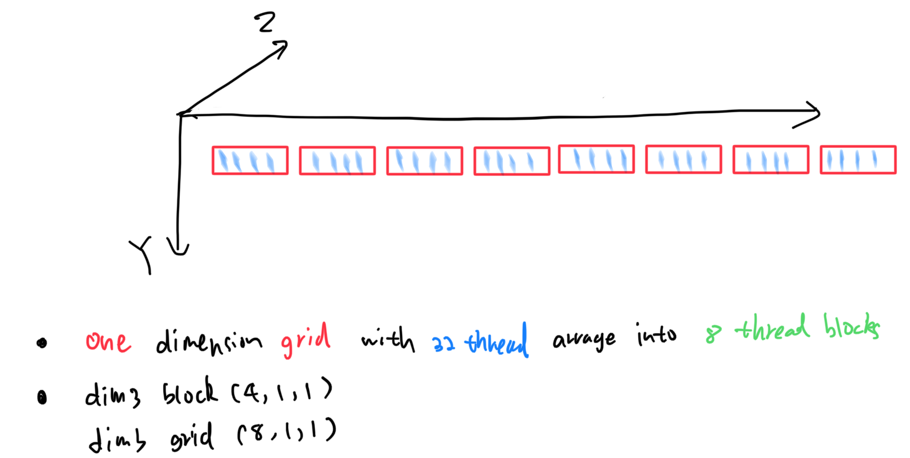

# cuda-tutorial

## Basic steps of a CUDA program

1. Initialization of data from CPU
2. Transfer data from CPU context to GPU context
3. Kernel launch with needed grid/block size
4. Transfer results back to CPU context from GPU context
5. Reclaim the memory from both CPU and GPU

## Hello World 
```c
#include "cuda_runtime.h"
#include "device_launch_parameters.h"

#include <stdio.h>

__global__ void hello_cuda()
{
    printf("hello cuda world! \n ");
}

int main()
{
    hello_cuda <<<1, 1>>> (); 
    cudaDeviceSynchronize();
    cudaDeviceReset();
    return 0;
}
```

## Grid and Block

**Grid** is a collection of all the threads launch for a kernel.

**Block**: Threads in a grid is organized in to groups called thread blocks.



```cpp
kernel_name <<< number_of_blocks, thread_per_block >>> (arguments)
```
same as
```cpp
kernel_name <<< grid, block >>> (arguments)
```


